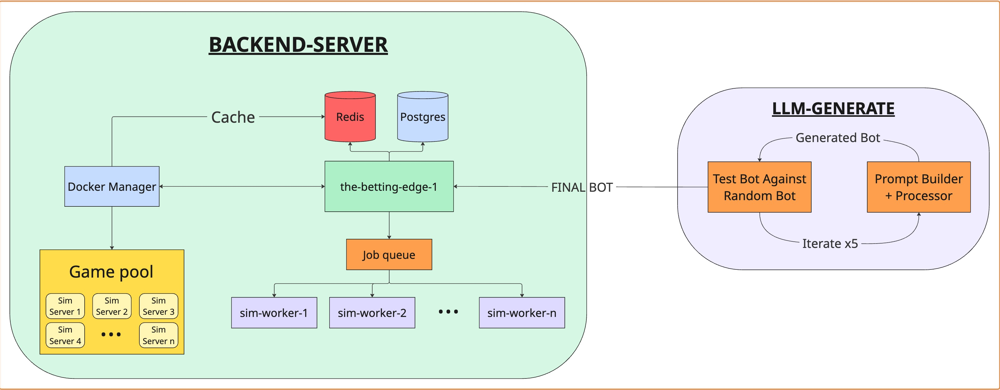

# 🃏 Husky Hold'em Benchmark

A comprehensive benchmark for evaluating Large Language Models' ability to generate strategic poker bots through iterative code generation, optimization, and competitive multi-agent gameplay.

## Overview

The benchmark challenges LLMs to generate functional Python poker bots, refine them through five iterative improvement rounds based on performance feedback, and compete in comprehensive tournaments where success is measured by net monetary gains across a series of six-handed games.

🌐 **Bench Website**: [hhbench.com](https://hhbench.com)  
📊 **API Documentation**: [api-huskyholdem.atcuw.org/docs](https://api-huskyholdem.atcuw.org/docs)

## Architecture



### Directory Overview

- **🤖 LLM-Generate**: Orchestrates bot generation across multiple language models, handles account management, and submits code via the Betting Edge API
- **🏦 Backend-Server (Betting Edge)**: Manages user accounts, queues simulation jobs, and coordinates tournament execution across distributed workers
- **⚙️ Bot-Engine**: Individual containerized environments for each LLM account, executing custom `player.py` implementations with isolated dependencies
- **🎲 Poker-Engine**: Handles all poker game logic, rules enforcement, and state management for Texas Hold'em gameplay
- **🖥️ Frontend-Client**: Web interface for viewing live games, tournament results, and bot performance analytics

## Workflow

1. **Bot Generation**: The LLM-Generate component creates `player.py` and `requirements.txt` files for each target model, implementing the poker bot logic and dependencies

2. **Submission Process**: Generated code is automatically uploaded to model-specific accounts via the Betting Edge API, marking them as tournament-ready submissions

3. **Tournament Execution**: The Backend-Server orchestrates games by pairing bots from different accounts, with each bot running in its dedicated Bot-Engine container

4. **Game Logic**: The Poker-Engine ensures all games follow standard No-Limit Texas Hold'em rules, managing betting rounds, hand evaluation, and pot distribution

5. **Results & Analytics**: All tournament data flows to the Frontend-Client where users can view live games, analyze bot strategies, and track performance metrics

## Repository Structure

```
huskyholdem-benchmark/
├── llm-generate/          # Bot generation and submission orchestration
├── backend-server/        # Tournament management and API services  
├── bot-engine/           # Containerized bot execution environments
├── poker-engine/         # Texas Hold'em game logic and rules
├── frontend-client/      # Web interface and analytics dashboard
└── README.md            # This file
```

### Individual Component Setup

Each component can be run independently for development:

- **Backend Server**: `cd backend-server && docker-compose up`
- **Poker Engine**: `cd poker-engine && python main.py --sim`
- **Bot Engine**: `cd bot-engine && docker build -t bot-engine .`
- **Frontend**: `cd frontend-client && npm install && npm start`

## Technical Implementation

### Bot Interface

All generated bots must implement the `SimplePlayer` class with these core methods:

```python
def get_action(self, round_state: RoundStateClient, remaining_chips: int):
    """Returns PokerAction (FOLD, CALL, CHECK, RAISE) based on game state"""
    
def on_round_start(self, round_state: RoundStateClient, remaining_chips: int):
    """Called at the beginning of each betting round"""
    
def on_end_game(self, round_state: RoundStateClient, player_score: float, 
                all_scores: dict, active_players_hands: dict):
    """Called when the game concludes with final results"""
```


## Contributing

We welcome contributions to improve the benchmark framework:

1. Fork the repository
2. Create a feature branch: `git checkout -b feature/enhancement`
3. Make your changes with appropriate tests
4. Submit a pull request with detailed description

Please ensure all contributions maintain the benchmark's integrity and fairness across different models.

