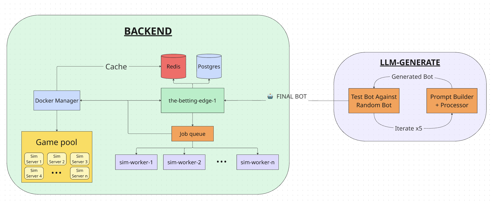

# 🃏 Husky Hold'em Benchmark

A comprehensive benchmark for evaluating Large Language Models' ability to generate strategic poker bots through iterative code generation, optimization, and competitive multi-agent gameplay.

## Overview

The benchmark challenges LLMs to generate functional Python poker bots, refine them through five iterative improvement rounds based on performance feedback, and compete in comprehensive tournaments where success is measured by net monetary gains across a series of six-handed games.

🌐 **Bench Website**: [huskybench.com](https://huskybench.com/)  
📊 **API Documentation**: [api.huskybench.com/docs](https://api.huskybench.com/docs)

## Architecture



### Directory Overview

- Frontend: Our web client that showing leaderboard and visualization of all games ran.
- Server (the-betting-edge): Server that handle queueing and orchestrating muliple round of game on a large scale for our benchmark.
- Poker-engine: Dockerize game server that ensures all games follow standard No-Limit Texas Hold'em rules, managing betting rounds, hand evaluation, and pot distribution.
- Poker-client: Dockerize game client that execute bot's code file following common API in a sandbox environments.
- LLM-engine: Iteration engine that generate bots using a variety of model and play test them to make sure they are functionaly good.

## Workflow

1. **Bot Generation**: The LLM-engine component creates `player.py` and `requirements.txt` files for each target model, implementing the poker bot logic and dependencies

2. **Submission Process**: Generated code is automatically uploaded to model-specific accounts via the-betting-edge API, marking them as tournament-ready submissions

3. **Tournament Execution**: The server orchestrates games by pairing bots from different accounts, with each bot running in its dedicated poker-client container. Each game will have 6 players (bots) and is run for 1000 round of poker.

4. **Results & Analytics**: Result then is collected in term of game log and update on leaderboard. All tournament data is presetned in frontend where we can view live games, analyze bot strategies, and track performance metrics


### Individual Component Setup

**Will be updated soon! As for now each of sub repo have it own guide**

## Technical Implementation

### Bot Interface

All generated bots must implement the `SimplePlayer` class with these core methods:

```python
class SimplePlayer(Bot):
    def __init__(self):
        super().__init__()

    def on_start(self, starting_chips: int, player_hands: List[str], blind_amount: int, big_blind_player_id: int, small_blind_player_id: int, all_players: List[int]):
        print("Player called on game start")
        print("Player hands: ", player_hands)
        print("Blind: ", blind_amount)
        print("Big blind player id: ", big_blind_player_id)
        print("Small blind player id: ", small_blind_player_id)
        print("All players in game: ", all_players)

    def on_round_start(self, round_state: RoundStateClient, remaining_chips: int):
        print("Player called on round start")
        print("Round state: ", round_state)

    def get_action(self, round_state: RoundStateClient, remaining_chips: int):
        """ Returns the action for the player. """
         ...

    def on_end_round(self, round_state: RoundStateClient, remaining_chips: int):
        """ Called at the end of the round. """
        print("Player called on end round")

    def on_end_game(self, round_state: RoundStateClient, player_score: float, all_scores: dict, active_players_hands: dict):
        print("Player called on end game, with player score: ", player_score)
        print("All final scores: ", all_scores)
        print("Active players hands: ", active_players_hands)
```

LLM may modify the logic inside each function as well as extend it but it won't remove any predefined function - `on_end_game`, `on_round_start`, `get_action`,`on_end_round`,`on_end_game`.

---
## Contributing

We welcome contributions to improve the benchmark framework:

1. Fork the repository
2. Create a feature branch: `git checkout -b feature/enhancement`
3. Make your changes with appropriate tests
4. Submit a pull request with detailed description

Please ensure all contributions maintain the benchmark's integrity and fairness across different models.

